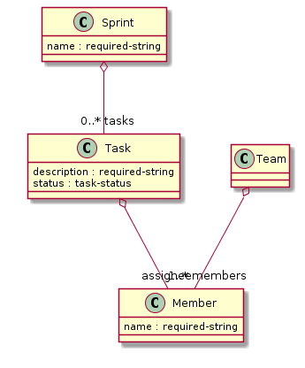

domaintypes
===========

Modeling domain data on the basis of Clojure records.

Motivation
----------
Default records are a more formal (and performant) way for describing and 
keeping domain data than pure maps. To model and discuss domain data types
with domain experts it is often desirable to attach domain type information
to fields of records. It is also beneficial to formalize the range
of admissable values for each field, therefore one should be able to
attach constraints on different levels of the domain types model.

Finally it would be nice to generate a graphical overview for a domain
type model, e.g. a UML class diagram.

The core project offers functionality to define simple types
(instances represent scalar values) and
complex types (instances represent structured data).

The resulting plain Clojure Records do not put constraints on the data
that one can store in instances. Instead a valid? function checks
on-demand if the data meets the constraints, for instance right before
data is persisted in a database, or after deserialization from a
message received from a remote part of the system.

Projects
--------
 - [core](core) provides the macros for defining 
   simple types and complex types, plus some functionality for
   validation.

 - [lein-domaintypesdoc](lein-domaintypesdoc) is a leiningen plugin 
   that generates PlantUML class diagram and PNG image from namespaces containing
   domain types.

 - [samples](samples) contains a demonstration how the macros are used.

Usage
-----
In your project.clj add a dependency

    [domaintypes/core "1.0.1"]

and a plugin dependency

    [domaintypes/lein-domaintypesdoc "1.0.1"]

Specify additionally with the `:domaintypesdoc-for` key which namespaces should be
searched for domain types to be included in a UML class diagram.
See the [sample project.clj](samples/project.clj).

A [sample model](samples/src/samples/projectmanagement.clj) would be described like this

    (defsimpletype required-string "A non-blank string" string? #(> (count %) 0))
    (defsimpletype task-status "Status of a Task" #{:new :in-progress :done})

    (defcomplextype Member [name {:dt required-string}])

    (defcomplextype Team [members {:dt Member :card [1 any]}])

    (defcomplextype Task [description {:dt required-string}
                          status      {:dt task-status}
                          assignee    {:dt Member :nillable true}])

    (defcomplextype Sprint [name  {:dt required-string}
                            tasks {:dt Task :card [0 any]}])

A corresponding graphical overview of complex types looks like this

The image file in the samples/target dir is created by the command

    $ lein domaintypesdoc
